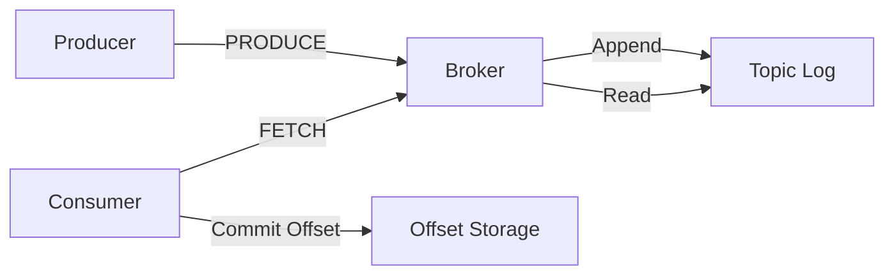

# EverestMQ Phase 1 - Production-Grade Single-Node MQ

EverestMQ is a high-performance, single-node message queue system built with Java and Netty. It follows a Kafka-style append-only log architecture for message persistence and consumer offset management.

## Architecture Diagram



## Data Flow
1. **Producer → Broker**: Producer sends a `PRODUCE` request containing topic, optional key, and payload.
2. **Broker → Log**: Broker auto-creates the topic if it doesn't exist, assigns an offset, and appends the message to an append-only `.log` file.
3. **Consumer → Broker**: Consumer sends a `FETCH` request with a starting offset and batch size. Broker uses long-polling to wait for data if none is available.
4. **Broker → Consumer**: Broker reads messages from disk and returns them. If end of log is reached, returns `END_OF_LOG`.
5. **Offset Lifecycle**: Consumer tracks its current offset and commits it to a local `.dat` file after successful processing.

## Storage Structure
Data is stored in the `everestmq_data/` directory by default:
- `<topic>.log`: Append-only binary log containing messages.
- `<topic>-offset.dat`: Persistent storage for consumer offsets (atomic write).

### Message Log Format
`[4B magic][8B offset][8B timestampMs][4B keyLen][NB key][4B payloadLen][NB payload][1B newline]`

## Configuration Guide

Configuration is handled via `application.properties`, environment variables (e.g., `EVERESTMQ_BROKER_PORT`), or programmatically.

| Property | Default | Description |
|----------|---------|-------------|
| `everestmq.broker.host` | `localhost` | Broker host for clients |
| `everestmq.broker.port` | `9876` | Broker listening port |
| `everestmq.data.dir` | `everestmq_data` | Directory for log and offset storage |
| `everestmq.logging.level` | `INFO` | Root logging level |
| `everestmq.log.flush.interval.ms` | `100` | Interval for flushing logs to disk |
| `everestmq.consumer.poll.timeout.ms` | `500` | Long-polling timeout |
| `everestmq.consumer.batch.size` | `10` | Maximum messages per poll |
| `everestmq.consumer.offset.auto.commit` | `true` | Whether to automatically commit offsets |
| `everestmq.producer.retry.count` | `3` | Number of retries for produce requests |
| `everestmq.producer.retry.backoff.ms` | `100` | Delay between retries |

## Usage Guide

### Running the Broker
```java
EverestBrokerServer server = new EverestBrokerServer();
server.start();
```

### Producing Messages
```java
Properties config = new Properties();
config.setProperty("everestmq.broker.host", "localhost");
config.setProperty("everestmq.broker.port", "9876");

try (EverestProducer producer = new EverestProducer(config)) {
    producer.send("my-topic", "key".getBytes(), "Hello EverestMQ".getBytes());
}
```

### Consuming Messages
```java
Properties config = new Properties();
config.setProperty("everestmq.consumer.batch.size", "5");

try (EverestConsumer consumer = new EverestConsumer(config)) {
    consumer.subscribe("my-topic");
    List<EverestMessage> batch = consumer.poll();
    for (EverestMessage msg : batch) {
        System.out.println("Received: " + msg.getPayload());
    }
}
```

## Maven Metadata
- **Name**: EverestMQ
- **Description**: Production-grade, single-node message queue.
- **License**: Apache License 2.0
- **Artifacts**: Main JAR, Source JAR, Javadoc JAR.
